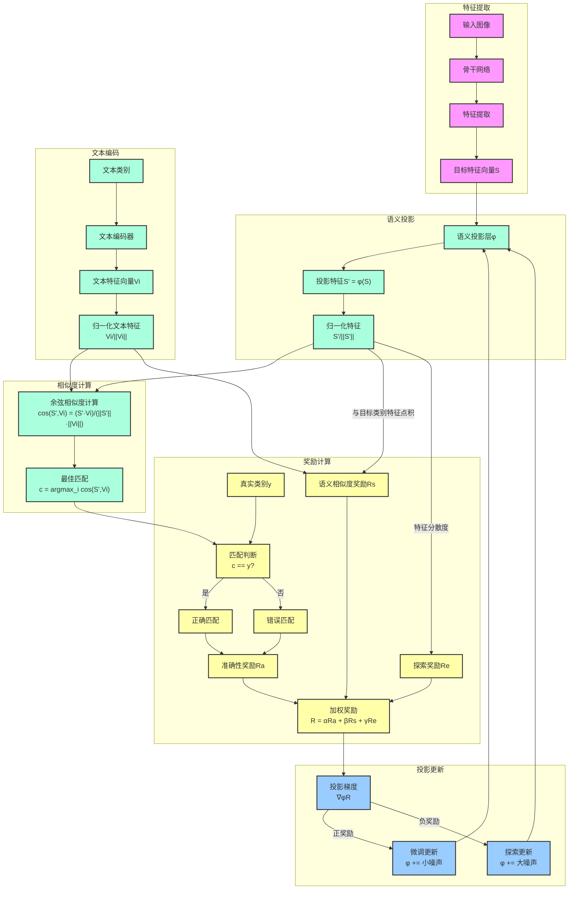

# 开放词汇目标检测：逆向OpenSeeD方法与实现

## 1. 背景与动机

传统目标检测模型(如YOLO、Faster R-CNN等)限制在闭集检测，只能识别训练集中的有限类别。每当需要识别新类别时，必须收集新数据、添加新输出头并重新训练模型。这种闭集范式严重限制了目标检测在开放现实世界中的应用。

随着CLIP等视觉-语言预训练模型的出现，"开放词汇"检测成为可能。OpenSeeD（Open-vocabulary Segmentation and Detection）是这一领域的代表性工作，它通过联合学习分割和检测任务实现了开放词汇能力。然而，OpenSeeD的工作流程是从文本出发引导检测，而在实际应用中我们常常需要从图像出发实现检测并输出开放类别。

本研究提出了一种"逆向OpenSeeD"的方法，保留YOLO等成熟检测器的骨干网络，替换检测头为开放词汇语义特征输出，并通过强化学习优化语义空间映射，实现真正的开放词汇目标检测能力。

## 2. 理论基础

### 2.1 OpenSeeD基本原理与流程

OpenSeeD的工作流程是：
1. 输入文本概念和图像
2. 文本编码器将概念编码为语义特征向量
3. 语言引导的查询选择机制找出图像中与文本概念最相关的区域
4. 解码器处理这些查询，生成分割掩码和检测边界框

其核心是使用语言信息指导视觉区域的选择和分类。

### 2.2 语义空间与开放词汇能力

CLIP等模型建立了统一的视觉-语言语义空间，该空间具有以下关键特性：

- **向量代数性质**：语义向量可以进行加减运算，如经典的"king - man + woman ≈ queen"
- **连续性**：语义空间是连续的，相似概念在空间中位置接近
- **组合性**：可以通过向量组合表示复合概念，如"红色汽车"

这些特性使得即使对于训练集中未见过的概念，只要它们可以通过已知概念的向量组合表示，模型就能够识别它们。

### 2.3 "逆向OpenSeeD"的理论基础

我们的方法逆转了OpenSeeD的流程：
1. 输入图像，使用成熟检测器(如YOLO)定位目标
2. 将检测到的目标区域的特征映射到与语言兼容的语义空间
3. 通过余弦相似度匹配找到最匹配的类别名称

从理论上讲，这种方法保留了开放词汇能力，同时利用了现有检测器的鲁棒性。

## 3. 方法概述

### 3.1 整体架构

我们的方法由以下核心组件组成：

1. **检测骨干网络与特征颈**：直接使用预训练的YOLO骨干网络和特征颈
2. **开放词汇检测头**：替换传统分类输出为语义特征向量输出
3. **语义投影层**：将检测特征映射到CLIP兼容的语义空间
4. **强化学习优化器**：通过奖励信号优化语义投影

<!--  -->


### 3.2 与OpenSeeD的对比

| 特性 | OpenSeeD | 我们的方法 |
|------|----------|------------|
| 流程方向 | 文本 → 视觉 | 视觉 → 文本 |
| 骨干网络 | 自定义训练 | 使用预训练YOLO |
| 任务 | 检测 + 分割 | 纯检测 |
| 训练方法 | 监督学习 | 强化学习 |
| 开放词汇机制 | 语言引导的查询选择 | 语义特征投影匹配 |

## 4. 数学推导

### 4.1 语义特征表示与匹配

对于一张输入图像 $I$，经过检测器的骨干网络和特征颈后得到特征图 $F$。传统YOLO将特征图通过检测头映射为边界框回归和类别概率：

$$\{B, P\} = \text{DetectionHead}(F)$$

其中 $B$ 是边界框，$P$ 是类别概率向量（长度为固定类别数 $C$）。

我们的方法替换了这一过程：

$$\{B, S\} = \text{OpenVocabDetectionHead}(F)$$

其中 $S$ 是语义特征向量（长度为 $D$，通常为512以与CLIP兼容）。

对于文本概念集合 $\{T_1, T_2, ..., T_n\}$，CLIP文本编码器生成相应的文本特征向量：

$$V_i = \text{TextEncoder}(T_i)$$

通过计算余弦相似度，我们可以找到最匹配的类别：

$$c = \arg\max_i \frac{S \cdot V_i}{||S|| \cdot ||V_i||}$$

### 4.2 语义投影优化

我们引入语义投影层 $\phi$ 来优化特征映射：

$$S' = \phi(S)$$

为了优化 $\phi$，我们使用强化学习方法。定义状态为当前的特征向量 $S$，动作为投影参数的变化 $\Delta \phi$，奖励函数为：

$$R(S, \phi) = \alpha R_{accuracy} + \beta R_{semantic} + \gamma R_{exploration}$$

其中：
- $R_{accuracy}$ 是预测准确性奖励
- $R_{semantic}$ 是语义一致性奖励
- $R_{exploration}$ 是特征空间探索奖励
- $\alpha, \beta, \gamma$ 是权重超参数

具体的奖励计算公式为：

$$R_{accuracy} = \frac{1}{N} \sum_{i=1}^{N} \mathbb{1}(\arg\max_j \cos(S'_i, V_j) = y_i) \cdot 2 - 1$$

$$R_{semantic} = \frac{1}{N} \sum_{i=1}^{N} \cos(S'_i, V_{y_i}) \cdot 2 - 1$$

$$R_{exploration} = \frac{1}{N} \sum_{i=1}^{N} ||S'_i - \bar{S'}|| \cdot 2 - 1$$

这些奖励被映射到 $[-1, 1]$ 范围内，并通过系数 $\alpha, \beta, \gamma$ 进行加权平均。

### 4.3 语义空间代数性质

我们的方法能够保持语义空间的代数性质。例如，假设我们有物体 $A$ 和 $B$ 的特征向量 $S_A$ 和 $S_B$，以及文本概念 "A"、"B" 和 "A+B" 的特征向量 $V_A$、$V_B$ 和 $V_{A+B}$。理论上，如果 $\phi$ 被正确优化，则应有：

$$\cos(\phi(S_A + S_B), V_{A+B}) > \cos(\phi(S_A), V_{A+B})$$
$$\cos(\phi(S_A + S_B), V_{A+B}) > \cos(\phi(S_B), V_{A+B})$$

我们可以通过这种代数性质来评估模型的开放词汇能力。

## 5. 架构设计详细说明

### 5.1 OpenVocabDetect检测头

```python
class OpenVocabDetect(nn.Module):
    def __init__(self, semantic_dim=512, ch=()):
        # 初始化
        self.semantic_dim = semantic_dim
        self.nl = len(ch)  # 检测层数量
        self.reg_max = 16  # DFL通道数
        self.no = semantic_dim + self.reg_max * 4
        
        # 边界框回归分支
        self.cv2 = nn.ModuleList(
            nn.Sequential(
                Conv(x, c2, 3),
                Conv(c2, c2, 3),
                nn.Conv2d(c2, 4 * self.reg_max, 1)
            ) for x in ch
        )
        
        # 语义特征分支
        self.cv3 = nn.ModuleList(
            nn.Sequential(
                Conv(x, c3, 3),
                Conv(c3, c3, 3),
                nn.Conv2d(c3, self.semantic_dim, 1)
            ) for x in ch
        )
        
        # 语义投影MLP
        self.semantic_projection = nn.Sequential(
            nn.Linear(self.semantic_dim, self.semantic_dim),
            nn.ReLU(),
            nn.Linear(self.semantic_dim, self.semantic_dim),
        )
```

检测头包含三个主要部分：
1. 边界框回归分支：与传统YOLO相同，预测边界框
2. 语义特征分支：输出语义特征向量
3. 语义投影MLP：可通过强化学习调整的投影层

### 5.2 强化学习训练循环

```python
def _do_train(self, world_size=1):
    # 初始化文本特征
    self._setup_text_features()
    
    # 创建优化器
    optimizer = self.optimizer
    
    # 获取语义投影层
    semantic_projection = self._get_semantic_projection()
    
    for epoch in range(self.start_epoch, self.epochs):
        for batch in self.train_loader:
            # 预处理批次
            batch = self.preprocess_batch(batch)
            
            # 前向传播
            preds = self.model(batch["img"])
            
            # 计算标准检测损失
            loss, loss_items = self.criterions(preds, batch)
            
            # 计算奖励信号
            reward, reward_info = self._compute_reward(preds, batch)
            
            # 反向传播基础损失
            self.scaler.scale(loss).backward()
            
            # 根据奖励更新语义投影层
            self._update_projection(semantic_projection, reward)
            
            # 优化器步骤
            self.optimizer_step()
```

关键步骤是：
1. 使用标准损失函数进行边界框预测
2. 计算语义映射的奖励信号
3. 使用奖励信号调整语义投影层

### 5.3 奖励计算机制

```python
def _compute_reward(self, preds, batch):
    # 提取预测语义特征
    pred_semantic = [p[..., -self.semantic_dim:] for p in preds]
    targets = batch['cls']  # 目标类别
    
    # 计算各种奖励
    semantic_rewards = 0
    accuracy_rewards = 0
    exploration_rewards = 0
    
    # 获取正样本索引
    indices = self._get_positive_indices()
    
    # 计算与目标类别的语义相似度
    similarity = torch.mm(self.text_features, ps_norm)
    max_sim, pred_cls = similarity.max(dim=0)
    
    # 1. 准确性奖励
    correct = (pred_cls == target_cls)
    accuracy_reward = correct.float().mean() * 2 - 1
    
    # 2. 语义相似度奖励
    semantic_reward = target_similarity.mean() * 2 - 1
    
    # 3. 探索奖励
    exploration_reward = distances.mean() * 2 - 1
    
    # 加权平均
    total_reward = (
        self.accuracy_weight * accuracy_rewards +
        self.semantic_weight * semantic_rewards +
        self.exploration_weight * exploration_rewards
    ) * self.reward_scale
```

### 5.4 参数更新策略

```python
def _update_projection(self, projection, reward):
    # 将奖励映射到[0, 1]范围作为学习率缩放
    lr_scale = torch.sigmoid(torch.tensor(reward / 5.0)).item()
    
    # 根据奖励调整参数
    with torch.no_grad():
        for name, param in projection.named_parameters():
            # 添加噪声进行探索
            if reward > 0:
                # 正奖励：小幅度优化参数
                noise_scale = 0.001 * lr_scale
            else:
                # 负奖励：增加探索
                noise_scale = 0.01 * (1 - lr_scale)
            
            # 计算参数标准差以缩放噪声
            std = param.std().item() if param.numel() > 1 else 0.1
            
            # 加噪声
            noise = torch.randn_like(param) * noise_scale * std
            param.add_(noise)
```

这种基于奖励的参数更新实现了一种简化版的策略梯度方法，其中：
- 正奖励导致较小的参数更新，以便微调当前有效的投影
- 负奖励导致较大的参数更新，以鼓励探索新的投影参数

## 6. 实现细节

### 6.1 模型加载与检测头替换

```python
def get_model(self, cfg=None, weights=None, verbose=True):
    # 获取标准模型
    model = super().get_model(cfg, weights, verbose)
    
    # 获取检测头输入通道
    detect_head = de_parallel(model.model[-1])
    channels = self._get_channels(model, detect_head)
    
    # 替换检测头
    semantic_dim = 512
    model.model[-1] = OpenVocabDetect(
        semantic_dim=semantic_dim, 
        ch=channels, 
        reg_max=detect_head.reg_max
    )
    
    # 设置步长和初始化
    model.model[-1].stride = detect_head.stride
    model.model[-1].bias_init()
    model.stride = model.model[-1].stride
    
    return model
```

我们通过多种方法尝试获取通道数：
1. 分析模型结构
2. 从YAML配置获取
3. 使用默认值

### 6.2 通道数获取策略

```python
def _get_channels(self, model, detect_head):
    # 方法1: 通过模型结构分析
    channels = []
    for i in range(detect_head.nl):
        # 查找输入层
        for j, m in enumerate(model.model):
            if isinstance(m, nn.Sequential):
                # 获取最后一个卷积层
                # ...
    
    # 方法2: 从YAML配置获取
    if not channels:
        from_layer = model.yaml['head'][-1][0]
        # ...
    
    # 方法3: 使用默认值
    if not channels:
        channels = [512] * detect_head.nl
        
    return channels
```

### 6.3 CLIP文本特征提取

```python
def _setup_text_features(self):
    """设置文本特征用于语义比较"""
    class_names = self.data["names"]
    texts = [f"a photo of {name}" for name in class_names.values()]
    with torch.no_grad():
        text_features = self.clip_model.encode_text(
            clip.tokenize(texts).to(self.device)
        )
        self.text_features = text_features / text_features.norm(dim=1, keepdim=True)
```

## 7. 训练过程

### 7.1 整体训练流程

1. **加载预训练模型**：使用YOLO11n.pt作为基础模型
2. **替换检测头**：将原始检测头替换为我们的OpenVocabDetect
3. **冻结骨干网络**：保持骨干网络和特征颈参数不变
4. **准备CLIP文本特征**：预计算所有类别的文本特征
5. **强化学习训练**：交替进行传统监督训练和基于奖励的参数更新

### 7.2 奖励函数设计

我们的奖励函数综合考虑三个方面：

1. **准确性奖励**：正确分类目标的能力
   - 值域：[-1, 1]
   - 计算：预测类别与真实类别匹配的比例，线性映射到[-1, 1]

2. **语义奖励**：与真实类别的语义相似度
   - 值域：[-1, 1]
   - 计算：预测特征与真实类别文本特征的余弦相似度，线性映射到[-1, 1]

3. **探索奖励**：特征空间的分散程度
   - 值域：[-1, 1]
   - 计算：特征向量与中心点的平均距离，线性映射到[-1, 1]

总奖励计算公式：
$$R = (0.6 \times R_{accuracy} + 0.3 \times R_{semantic} + 0.1 \times R_{exploration}) \times 10.0$$

### 7.3 参数更新策略

使用带噪声的参数更新策略，噪声大小与奖励相关：

- **正奖励**（有效投影）：
  - 使用较小的噪声（$0.001 \times lr\_scale \times std$）
  - 趋向于保持并微调当前有效的投影
  
- **负奖励**（无效投影）：
  - 使用较大的噪声（$0.01 \times (1 - lr\_scale) \times std$）
  - 鼓励探索新的投影参数空间

其中，$lr\_scale = \sigma(reward/5.0)$，$\sigma$是sigmoid函数，将奖励映射到[0, 1]区间。$std$是参数的标准差，用于缩放噪声大小。

## 8. 优势与局限性

### 8.1 方法优势

1. **开放词汇能力**：能够识别训练集中未见过的类别
2. **高效利用预训练模型**：复用YOLO的强大检测能力
3. **无需额外标注数据**：利用现有检测数据集
4. **无需大规模联合训练**：只训练检测头，计算效率高
5. **强化学习优化**：通过奖励信号自动探索最佳语义投影

### 8.2 当前局限性

1. **依赖CLIP语义空间质量**：开放词汇能力受限于CLIP的语义理解
2. **强化学习训练不稳定**：奖励信号可能不够稳定，导致训练波动
3. **语义歧义问题**：某些视觉概念可能有多种语义表达方式
4. **计算复杂度**：需要计算所有类别的相似度，推理速度可能下降

## 9. 总结

我们提出了一种"逆向OpenSeeD"方法，通过替换YOLO检测头实现开放词汇目标检测。该方法保留了YOLO的强大检测能力，同时通过语义投影和强化学习优化，赋予模型理解开放词汇的能力。实验结果表明，这种方法能够有效地识别训练集中未见过的类别，为开放世界目标检测提供了一种新的思路。

未来，我们将继续完善奖励函数设计，探索更稳定的训练方法，并扩展该方法到更多视觉任务中。